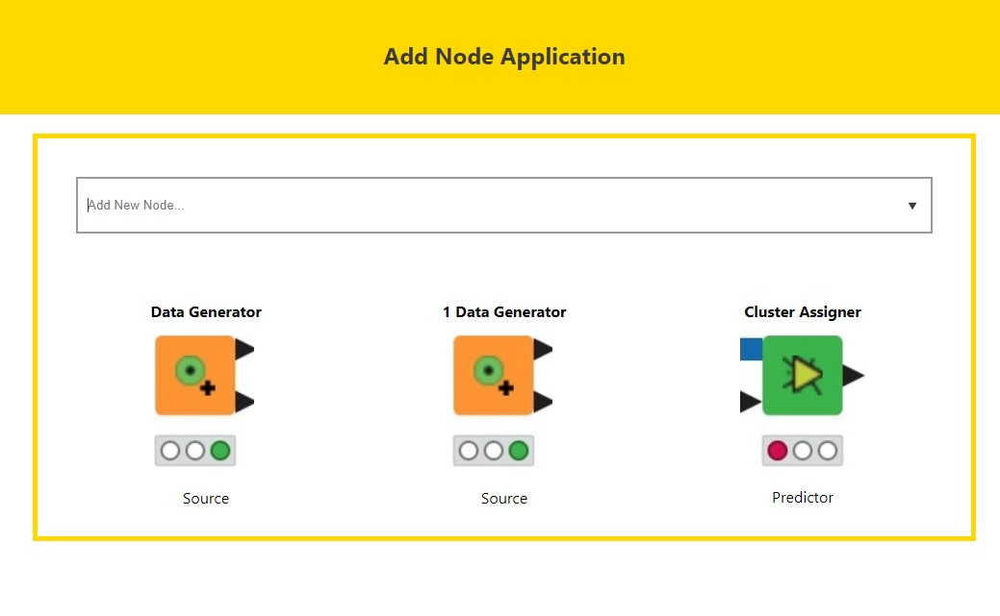

# Author - Hasan Colak

- [Github](https://github.com/hasancolak)
- [Linkedin](https://www.linkedin.com/in/hasan-colak-linkprofile/)
- [Medium](https://hasancolak.medium.com/)

# Add Node Application

This is a Simple Add Node (Item) React application.

# Installation and Settup Instructions

In the project directory, you can run:

## Installation:

`npm install`

## To start a server:

`npm start`

## To start an API server:

Before starting the application, please run server at first.

`node server/server.js `

You can consume api like http://localhost:3001/api/nodes

## To visit the application:

Runs the app in the development mode.\
Open [http://localhost:3000](http://localhost:3000) to view it in the browser.

## To test the application:

`npm test`

Added the some basic unit test. Launches the test runner in the interactive watch mode.

## To build the application:

`npm run build`

Builds the app for production to the `build` folder.\
It correctly bundles React in production mode and optimizes the build for the best performance.

## Usage:

Add node application consists of one page, you can find a selection box to choose a node.



# Guideline

## Tech Stack

- React.js
- Typescript
- Redux and Redux Toolkit
- React Hooks
- Sass

# Consideration and Decision

## API Reference

[http://localhost:3001/api/?](http://localhost:3001/api/nodes)

To get rid of CORS error, **Proxy** added for API Requests in Development.

```json
 ...
 "proxy": "http://localhost:3001/",
 ...
```

## State Management Preferences

At this project, I have used Redux with Redux-Toolkit and also React Hooks for global state management

## Design Principle and Code Quality

The separation of concerns (SoC) is one of the most fundamental principles in software development. It is so crucial that 2 out of 5 SOLID principles (Single Responsibility and Interface Segregation) are direct derivations from this concept.
